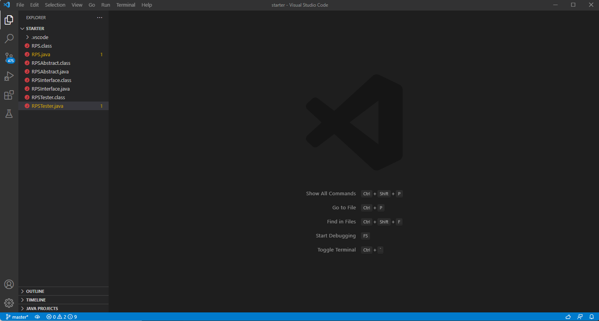
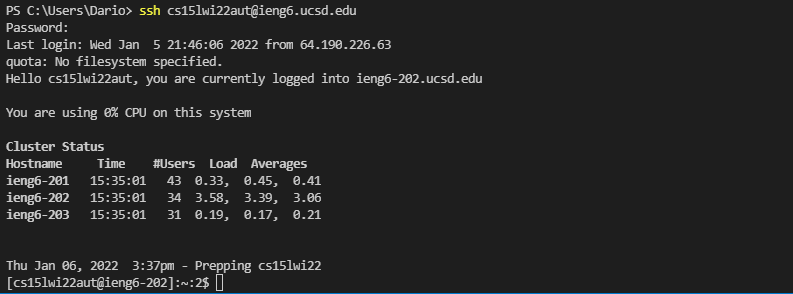
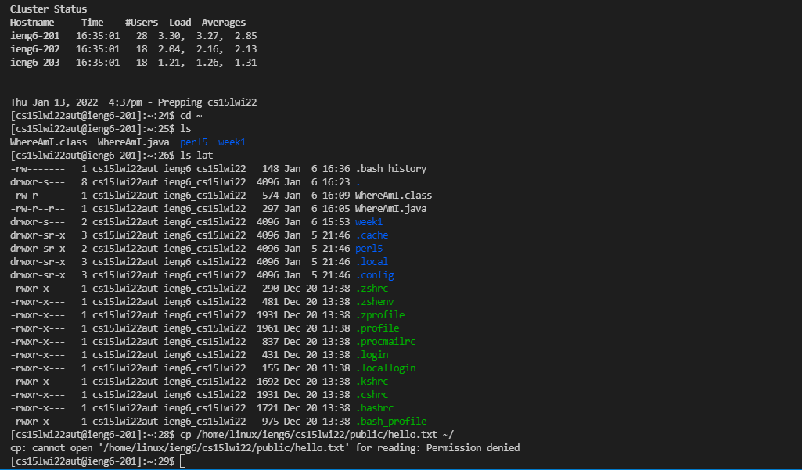
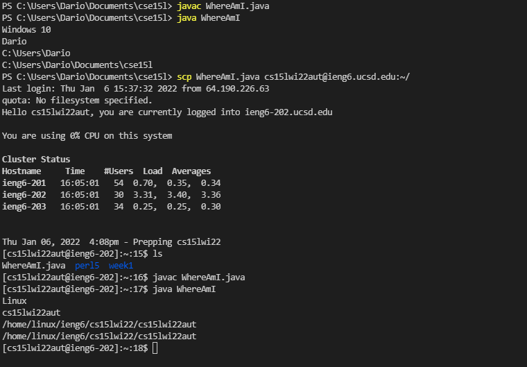
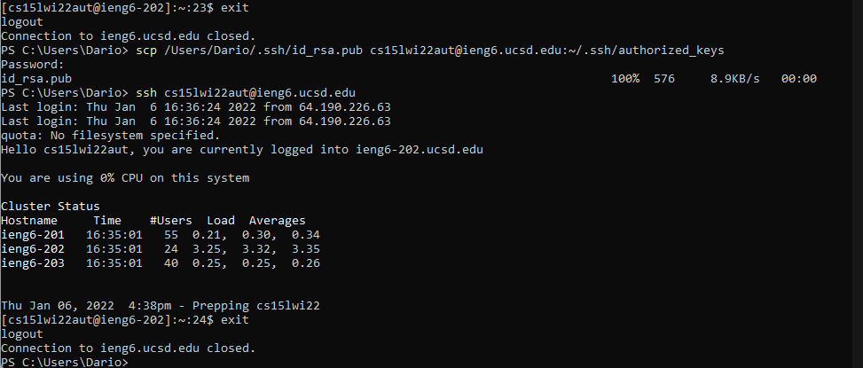
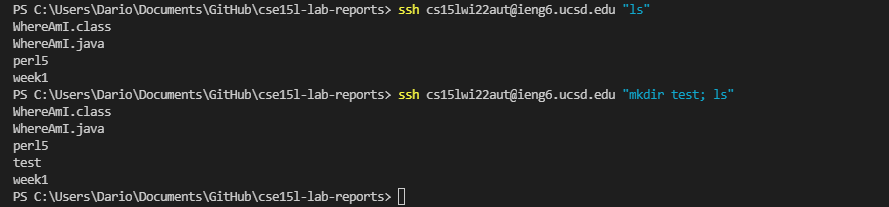

# How to Log on to ieng6

## Step 1: **Install Visual Studio Code**

Go to the [VSCode website](https://code.visualstudio.com/) and download the latest version.
When you open the IDE, it should look like this:

## Step 2: **Remotely Connecting**
Install [OpenSSH](https://docs.microsoft.com/en-us/windows-server/administration/openssh/openssh_install_firstuse)

Open a terminal in VS Code and we will connect to the ieng6 remote server by running this command: `ssh cs15lwi22zz@ieng6.ucsd.edu`.

Replace the 'zz' with your course specific account by looking it up [here](https://sdacs.ucsd.edu/~icc/index.php).

Once you log on to the server, enter your password and it should look like this:

## Step 3: **Trying Some Commands**
We can try running some commands like:
 - `cd` meaning change directory
 - `ls` meaning list all files in current directory
 - `ls -lat` meaning long list all files including hidden ones
 - `mkdir <name>` meaning make directory

Here are some examples:

## Step 4: **Moving Files with `scp`**
We can use the `scp` command to copy files from the client to the server.
For example, I created a file on my computer that displays my operating system, my user name, and my current directory.
I copied this file over and ran it both on the client and server, and they gave different outputs. 

The command I used was: `scp WhereAmI.java cs15lwi22aut@ieng6.ucsd.edu:~/`

Here is an image:

## Step 5: **Setting an SSH Key**
SSH Keys allow us to log on to a remote server faster: it creates a public key on the server and a private key on the client so that we do not have to enter our password everytime we log in. We can do this by running `ssh-keygen` on our computer.

Then, we make a directory called `.ssh` on the server and copy the public key (called `id_rsa.pub`) into that directory (using the `scp` command).

Here is an example of what it should look like:

## Step 6: **Optimizing Remote Running**
Different ways we can optimize remote running:
 - We can run commands remotely by adding our command in quotes are an SSH. It will log us out immediately afterwards.
 - We can run multiple commands at the same time by putting semicolons between each command.

Here are some examples:
