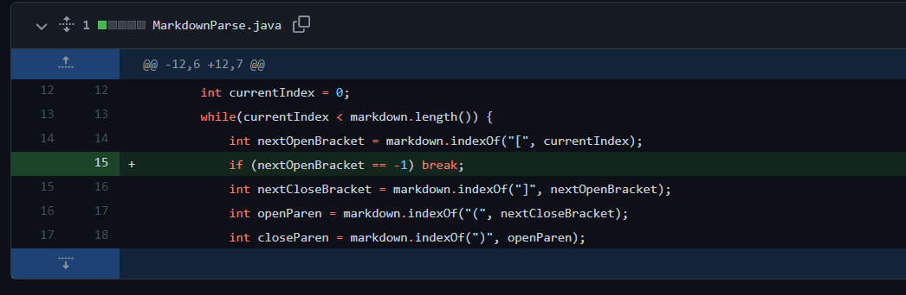
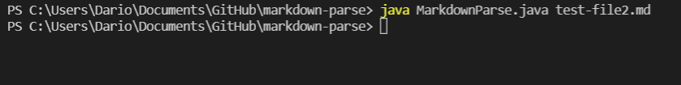
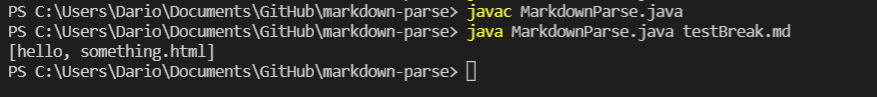
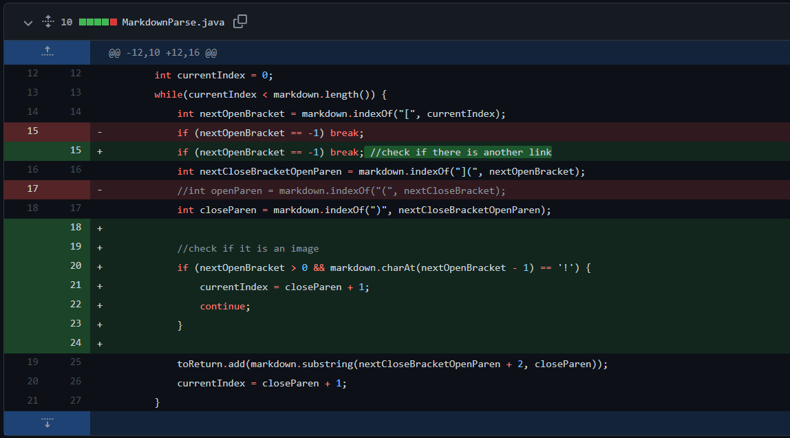

# Debugging

## Example 1
Code Change Diff:

Test File Link: [Here](https://github.com/drtzeng27/markdown-parse/commit/cc77cb88cf7fd53b878c2ab99b05b2ac1c786217)

Symptom: 

The failure inducing input contained a link with text that had a pair of both square brackets and parentheses. The old version of the program had a bug where it was unable to find a next open bracket, causing the variable to be set to -1. As a result, when we ran the code, the symptom was an infinite loop. To fix this bug, we added an if statement to check if the variable was -1.

**Though we fixed the infinite loop, we were unable to account for the pairs of parentheses and brackets within the link text since the code required for that fix is outside the scope of this class.

## Example 2
Code Change Diff:

Test File Link: [Here](https://github.com/drtzeng27/markdown-parse/commit/9b5d1f9a7446fa407202692dc43b607d3a692969)

Symptom: 

The failure inducing input contained pairs of parentheses and square brackets dispersed throughout regular text. We did not check if the brackets are next to the parentheses, so the symptom resulted in the program printing out regular text that was not a link. To fix this bug, we combined the search for "]" and "(" to "](", ensuring that the text inside the parentheses is a link.

## Example 3
Code Change Diff:

Test File Link: [Here](https://github.com/drtzeng27/markdown-parse/commit/2f5eb0423dd923f8fbbaa7f93e92320122d0a577)

Symptom: 

The failure inducing input contained Markdown syntax for an image, which is very similar to that of a link. The symptom was that the program returned an image file, thinking it was a link. We fixed this bug by simply checking if there was a "!" before the open brackets using an if statement.