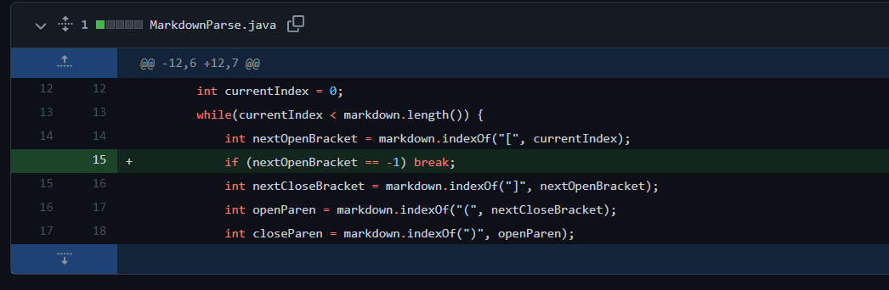
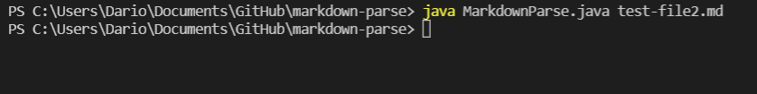
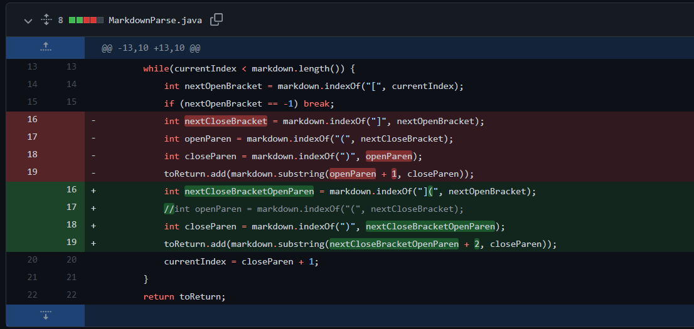
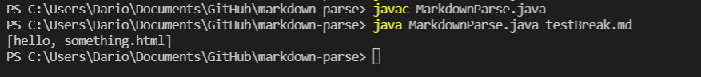
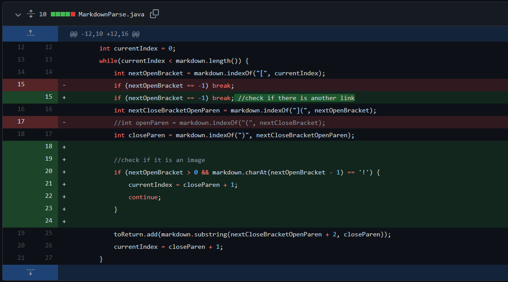
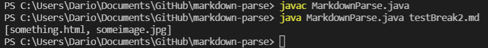

# Debugging

## Example 1
Code Change Diff:

Test File Link: [Here](https://github.com/drtzeng27/markdown-parse/commit/cc77cb88cf7fd53b878c2ab99b05b2ac1c786217)

Symptom: 

Bug, Symptom, and Failure Inducing Input:

## Example 2
Code Change Diff:

Test File Link: [Here](https://github.com/drtzeng27/markdown-parse/commit/9b5d1f9a7446fa407202692dc43b607d3a692969)

Symptom: 

Bug, Symptom, and Failure Inducing Input:

## Example 3
Code Change Diff:

Test File Link: [Here](https://github.com/drtzeng27/markdown-parse/commit/2f5eb0423dd923f8fbbaa7f93e92320122d0a577)

Symptom: 

Bug, Symptom, and Failure Inducing Input: