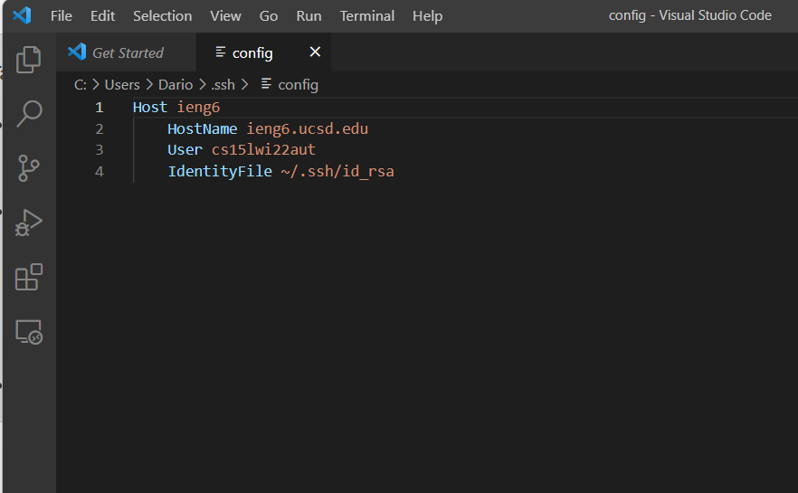
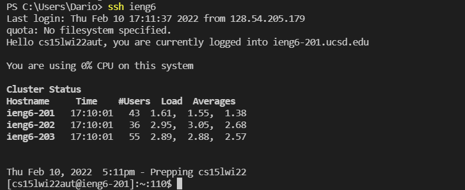
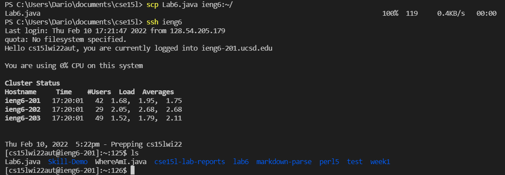

# Week 6 Lab Report

## Streamlining ssh configuration

 - Here I am editing the config file in Visual Studio Code. I made a file called config inside my .ssh folder and opened it on VS Code. I used the template given in the Lab instructions to configure my ssh. I also had to look for the name of my private ssh key on my computer and put it as my IdentityFile.

 - This is an example of how to use the configuration to make logging into a remote server more pleasant. Instead of typing out the entire address, we can now just type "ieng6", or whatever the host is in the config file. This will log us in the same way but in less time.

 - Here I am using the `scp` command in the same way I used `ssh`. I only have to type out "ieng6" instead of writing out my entire account name, making it much faster to copy files over to a remote directory.