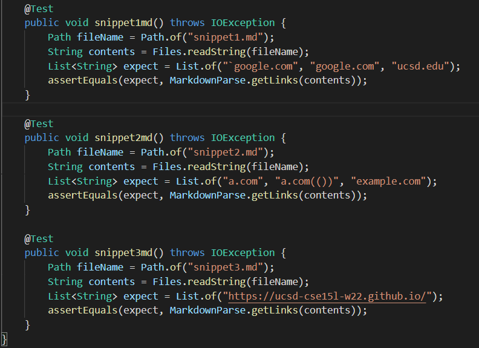
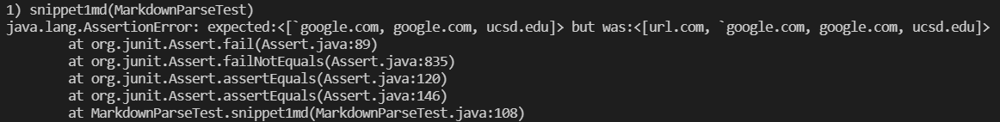
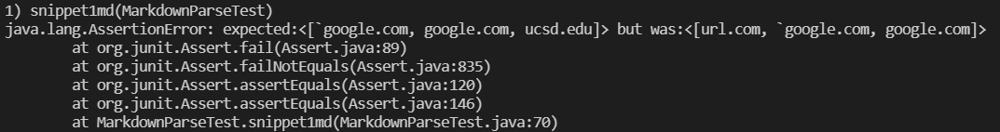
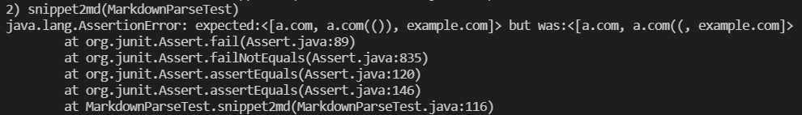
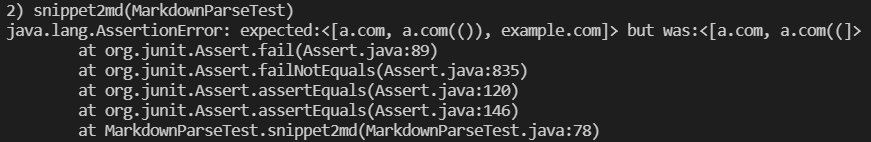
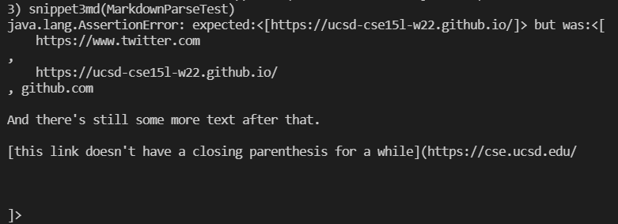
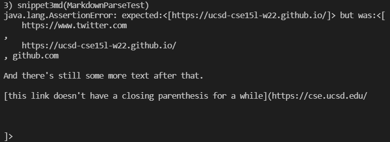

# Lab Report 4
[My Repository](https://github.com/drtzeng27/cse15l-lab-reports)

[Repository I reviewed](https://github.com/artballesteros/markdown-parse)

## Turning snippets into test cases
I created a JUnit test for each snippet:


## Snippet 1
Expected Output:
```
[`google.com, google.com, ucsd.edu]
```

My implementation output (failed):


Reviewed repository output (failed):


## Snippet 2
Expected Output:
```
[a.com, a.com(()), example.com]
```

My implementation output (failed):


Reviewed repository output (failed):


## Snippet 3
Expected Output:
```
[https://ucsd-cse15l-w22.github.io/]
```

My implementation output (failed):


Reviewed repository output (failed):



## Questions

Change for snippet 1
 -  I do not think there is a small change that we could make so that the program works for all test cases involving backticks. There are many different combinations of places within the square brackets or the parentheses where we could put the backticks, and all of them produce a different output. One possible solution is to check if there is a square bracket between two backticks, but that leaves out the edge case where there is another set of backticks before the link. We would also have to account for triple backticks in addition to single backticks.

 Change for snippet 2
  - I do not think there is a small change that we could make so that the program works for all test cases involving nested parentheses and brackets. We would have to keep track of the "balance" of the parentheses with another variable or even a stack data structure. There are too many different cases with parentheses to cover within 10 lines. We would also have to account of escaped brackets by keeping track of the '/' character.

Change for snippet 3
 - I think there is a small change we could make so that program works for test cases involving line breaks. We would have to check if the link title or the actual link itself contains a double line break ("\n\n"). If it does, it is not a valid link. After each iteration we would also set the currentIndex to the next open parentheses since there is a possibility that there is no corresponding closing parentheses. These 2 if statements are manageable in 10 lines.
