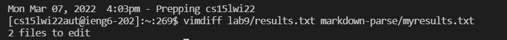
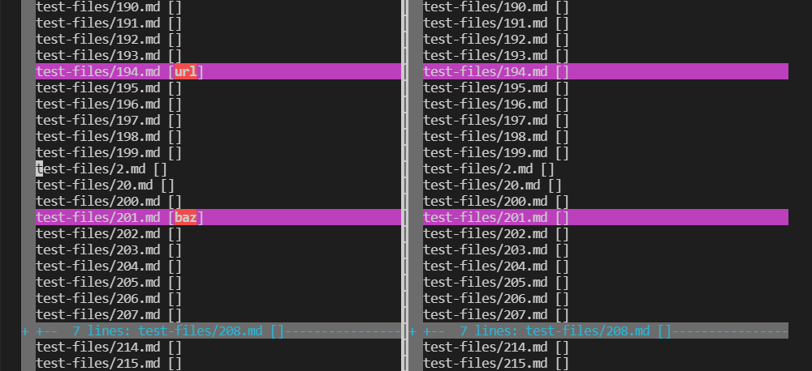
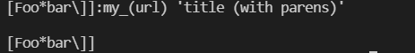
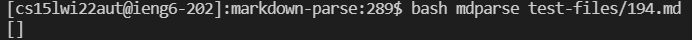
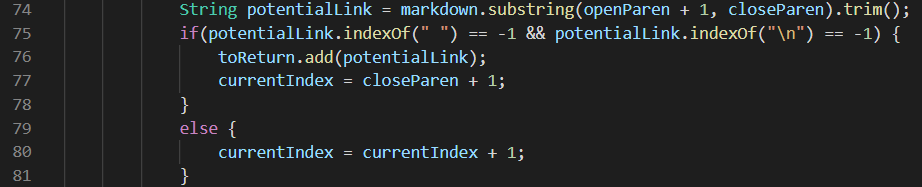
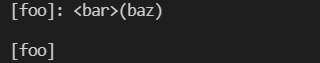
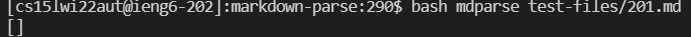
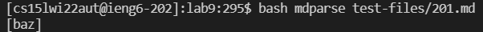
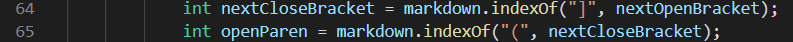

# Lab Report 5

## How I found different results
For each of the two markdown parse files, I ran a bash for loop on every test file provided by commonmark-spec. I used output redirection to put the outputs of the test files into a result text file by using this command:
```
$ bash script.sh > results.txt
```
I then used the `vimdiff` command to find the differences in the two resulting text files:



## Test Case 1: 194.md


My output for this test case:

Given code's output for this test case:

Expected Output:
```
[my_(url)]
```

What's wrong:
This is a weird test case because obviously, the expected output is not a valid link. We could argue that the expected output should just be `[]`, but the preview gives the above as the link. To figure out what was going on, I looked at the markdown documentation and found that this was a reference style link. The colon is essentially a variable assignment, and the content within the quotations is the title. 

This results in a lot more cases of how a link can appear on the page. We would have to check if there is a colon after a closing bracket and check if it is also a valid reference style link. Then we have to check if the reference is used anywhere in the actual page so that it shows up as a link on the html file. We could do these checks in the potential link if statement, but it would take a lot of code:


## Test Case 2: 201.md


My output for this test case:

Given code's output for this test case:

Expected Output:
```
[]
```

What's wrong:
My output for this case is correct, but the given repository's output is wrong. It seems that they have skipped over characters to search for the open parentheses, ignoring the standard '\[]\()' syntax. We could fix this easily by changing lines 64-65 in the MarkdownParse file. Instead of looking for the ']' and '(' character separately, we could look for the substring '](' as a whole to make sure that the syntax for the link is correct. Here is the place in the code that we could change:



